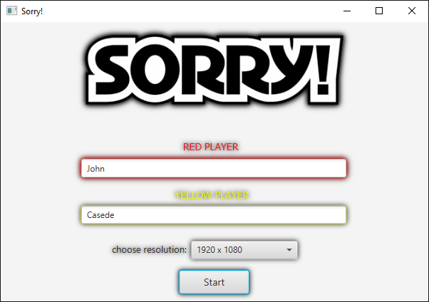
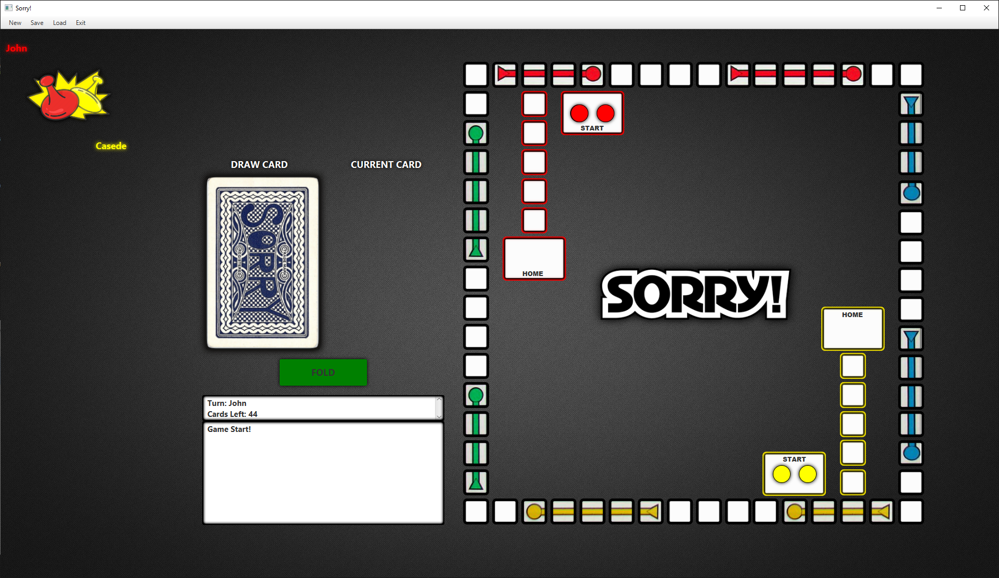
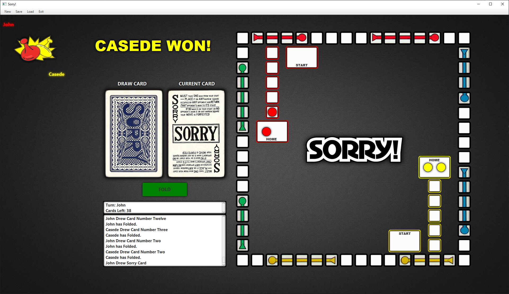

    

<h2 align="center">Board Game</h2>

<!-- TABLE OF CONTENTS -->

  
Table of Contents

  <ol>
    <li>
      <a href="#about-the-project">About The Project</a>
      <ul>
        <li><a href="#built-with">Built With</a></li>
      </ul>
    </li>
    <li><a href="#details">Details</a></li>
    <li><a href="#how-to-run">How to run</a></li>
    <li><a href="#gameplay">Gameplay</a>
        <ul>
            <li><a href="#features">Features</a></li>
            <li><a href="#shortcuts">Shortcuts</a></li>
        </ul>
    </li>
</ol>

<!-- ABOUT THE PROJECT -->

## About The Project

Sorry! Board Game is a two player game, both players play with the keyboard and mouse and the goal is to get
your two pawns from the start position to the home rectangle using cards.

(<a href="#top">back to top</a>)

### Built With

* [JDK-17-LTS](https://www.oracle.com/java/technologies/downloads/#java17)
* [JavaFx-19](https://openjfx.io/)
* [SceneBuilder](https://gluonhq.com/products/scene-builder/)

(<a href="#top">back to top</a>)

## Details

The project is a maven structured javafx application. You can find the 
UML diagrams of each controller and class in the UML diagrams folder.

(<a href="#top">back to top</a>)

## How to run

* Reload maven dependencies
* Download locally the javafx lib
* Add VM options: --module-path "PATH-TO-JAVAFX\javafx-sdk-17.0.6\lib" --add-modules javafx.controls,javafx.fxml
* Run Main in org.openjfx.view.Main

(<a href="#top">back to top</a>)

## Gameplay

The first thing you'll see is the login screen where you can input the players names and choose in
which resolution you want to play (you'll have a choice between 1366x768 and 1920x1080). 

Then you can start the game. 

This is the main game screen where you can draw cards and move your pawns based on the current card's effects.
To move a pawn you just need to drag and drop it, if you drop on a correct square the pawn will stay there and the turn will pass
to the next player. If not then the pawn will return to its original position. You also can fold a round if you can't make a move. On the bottom left you have a move logger that writes helpful messages.
Once a player has both of his pawns in the Home square the player will be victorious and the game will end. To start a new game you may do so by 
clicking it from the menu, in the top left corner or using the shortcut.

### Features

* ***Player next move glow helper:***  
when a pawn is clicked the board glows showing the next posible valid moves.

* ***In game log:***  
text area that prints card/draw/turn info.

* ***Cheats:***  
For easy testing of the card moves run Cheats.java.
	it comments out the fold and draw restrictions so you can move a pawn and draw cards unlimited times (all the other rules are the same [card,pawn,player,...]).
To remove cheats run AntiCheat.java (careful don't run AntiCheat if cheats weren't previously enabled).

### Shortcuts

* Shortcut keys:
    * Fold: `F`
    * Draw: `D`
    * New Game: `Ctrl+N`
    * Exit Game: `Ctrl+Q`
  
  
(<a href="#top">back to top</a>)

